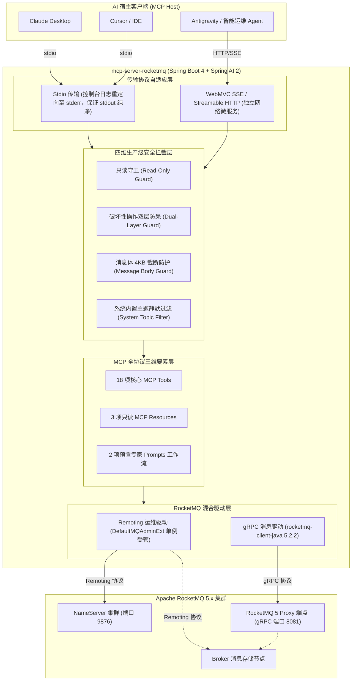

# mcp-server-rocketmq

<p align="center">
  <strong>🚀 基于 Spring AI 2 与 Spring Boot 4 构建的 Apache RocketMQ 5 智能化 Model Context Protocol (MCP) 服务端</strong>
</p>

<p align="center">
  <a href="https://github.com/atengk/mcp-server-rocketmq/actions/workflows/ci.yml">
    
  </a>
  <a href="https://github.com/atengk/mcp-server-rocketmq/releases">
    
  </a>
  <a href="https://www.npmjs.com/package/@atengk/mcp-server-rocketmq">
    
  </a>
  <a href="https://rocketmq.apache.org/">
    
  </a>
  <a href="https://docs.spring.io/spring-ai/reference/api/mcp/mcp-overview.html">
    
  </a>
  <a href="https://spring.io/projects/spring-boot">
    
  </a>
  <a href="https://www.oracle.com/java/technologies/downloads/#java21">
    
  </a>
  <a href="./LICENSE">
    
  </a>
  <a href="./CONTRIBUTING.md">
    
  </a>
</p>

---

## 📖 项目简介

`mcp-server-rocketmq` 是专为 **Apache RocketMQ 5** 打造的企业级智能化连接服务，完全遵循开放标准 [Model Context Protocol (MCP)](https://modelcontextprotocol.io/) 规范设计，基于 **Spring AI 2 (2.0.1) + Spring Boot 4 (4.1.0) + JDK 21** 现代云原生技术栈构建。

它将大语言模型智能体（如 Claude Desktop、Cursor、Antigravity 等各类 AI 编程助手与智能运维 Agent）与分布式消息中间件 Apache RocketMQ 5 深度打通。通过暴露标准化的 MCP **Tools（工具）**、**Resources（只读资源）** 与 **Prompts（专家排障工作流）**，赋能智能体通过自然语言直接探查集群健康、秒级定位消费堆积、全链路检索消息、排查死信根因，并安全受控地执行消息收发与位点治理。

---

## 🏗️ 系统拓扑架构

本项目采用 **Remoting 深度运维管理 + gRPC 云原生消息收发** 的混合双驱动架构（详见 [ADR 0001](./docs/adr/0001-hybrid-client-architecture.md)）：



---

## ✨ 核心能力与 MCP 协议要素矩阵

本项目完整落地 Model Context Protocol 的三大核心支柱：

### 1. 🧰 MCP Tools 核心工具集 (共 18 项工具)

| 核心领域 | 工具标识 (Tool Name) | 核心入参 (Parameters) | 职责说明 | 安全防护级别 |
| :--- | :--- | :--- | :--- | :--- |
| **集群拓扑域** | `rocketmq_cluster_info` | *（无入参）* | 查询 NameServer / Broker 节点分布、角色与在线状态 | 只读查询 |
| | `rocketmq_broker_stats` | **`brokerAddr`** | 查询指定 Broker 运行时核心指标（吞吐量、写入 TPS、物理磁盘水位） | 只读查询 |
| **主题生命周期** | `rocketmq_list_topics` | `includeSystem?` | 列出集群业务 Topic（自动隐藏系统内部管理主题） | 只读查询 |
| | `rocketmq_topic_route` | **`topic`** | 查询指定 Topic 的读写队列分布与 Broker 路由详情 | 只读查询 |
| | `rocketmq_topic_status` | **`topic`** | 查询指定 Topic 各分片队列的最小/最大 Offset 与堆积容量统计 | 只读查询 |
| | `rocketmq_create_topic` | **`topic`**, `readQueueNums?`, `writeQueueNums?`, `perm?` | 声明式创建或更新指定 Topic（动态配置队列数与读写权限） | 受 `read-only` 约束 |
| | `rocketmq_delete_topic` | **`topic`**, **`confirm: true`** | 彻底清理下线指定业务 Topic | 🚨 **双层防呆保护** |
| **消费组与积压** | `rocketmq_list_consumer_groups` | `includeSystem?` | 获取所有已注册的消费组清单 | 只读查询 |
| | `rocketmq_consumer_status` | **`consumerGroup`** | 查询消费组的在线客户端 ID、IP 端口及订阅详情 | 只读查询 |
| | `rocketmq_consumer_lag` | **`consumerGroup`**, `topic?` | 精确计算消费组在各分片队列的未消费堆积量 (Lag) | 只读查询 |
| | `rocketmq_top_consumer_lag` | `topN?` *(默认 10)* | **全集群积压排行榜**：极速检出堆积最严重的 TopN 消费组 | 只读查询 |
| | `rocketmq_reset_consumer_offset`| **`consumerGroup`**, **`topic`**, **`resetType`**, `timestamp?`, **`confirm: true`** | 按时间戳回溯或按最大位点跳过重置消费点位 | 🚨 **双层防呆保护** |
| **消息检索排查** | `rocketmq_query_message_by_id` | **`topic`**, **`msgId`** | 根据 32 位 Message ID 精确检索消息内容与用户属性 | 只读 (4KB截断) |
| | `rocketmq_query_message_by_key`| **`topic`**, **`key`**, `beginTimestamp?`, `endTimestamp?`, `maxNum?` | 根据业务 Key 在指定时间窗口内扫描匹配的消息列表 | 只读 (4KB截断) |
| | `rocketmq_query_dlq_messages` | **`consumerGroup`**, `maxNum?` | 检索指定消费组死信队列（DLQ）中的失败堆积消息 | 只读 (4KB截断) |
| | `rocketmq_query_message_trace` | **`msgId`**, `topic?` | 调阅单条消息自 Producer、Broker 至 Consumer 的全链路轨迹耗时 | 只读 (4KB截断) |
| **消息生产自愈** | `rocketmq_send_message` | **`topic`**, **`body`**, `tag?`, `keys?`, `messageGroup?`, `deliveryTimestamp?` | 发送测试消息（支持普通、分区顺序与定时延时消息） | 受 `read-only` 约束 |
| | `rocketmq_resend_dlq_message` | **`consumerGroup`**, **`msgId`**, **`targetTopic`**, **`confirm: true`** | 将死信队列中的指定消息重新投递回业务 Topic 触发重试 | 🚨 **双层防呆保护** |

> 📌 **注**：参数加粗表示必填项，带 `?` 表示可选参数；破坏性工具必须由模型显式传入 `confirm: true` 且启动配置放行，否则将被双层防呆拦截。


### 2. 📚 MCP Resources (只读上下文资源)

客户端连接时无需主动调用工具，即可将集群基础拓扑直接作为只读上下文挂载进会话：

- **`rocketmq://cluster/topology`**：集群物理拓扑快照（包含 Broker 节点名、角色 Master/Slave、地址及健康状态）。
- **`rocketmq://topics`**：当前集群所有业务主题清单与队列分布概览。
- **`rocketmq://server/status`**：MCP Server 自身运行时配置与防护策略（只读状态、破坏性工具开启状态）。

### 3. 💡 MCP Prompts (专家预置工作流)

客户端可一键触发针对复杂故障场景的标准化编排工作流：

- **`diagnose_consumer_lag`（消费堆积深度排障流）**：
  引导 AI 自动串联：`rocketmq_top_consumer_lag`（定位慢组）$\rightarrow$ `rocketmq_consumer_status`（检查消费者客户端活跃度）$\rightarrow$ `rocketmq_query_dlq_messages`（排查死信）$\rightarrow$ 输出根因结论与扩容/位点重置治理建议。
- **`cluster_health_check`（集群健康全面巡检流）**：
  全面巡检所有 Broker 节点吞吐、物理磁盘水位、读写队列分布与业务主题容量，自动汇总为结构化 Markdown 体检周报。

---

## 🛡️ 四维生产级安全防御体系

大语言模型具有生成幻觉与理解歧义的风险。为确保企业消息队列的绝对安全，本项目构建了四维安全屏障：

1. **只读保护守卫 (Read-Only Guard)**：
   设置 `ROCKETMQ_READ_ONLY=true` 时，服务将彻底封锁所有消息发送、主题创建/删除、位点重置与死信重投工具。
2. **双层防呆机制 (Dual-Layer Guard)**：
   针对破坏性工具（删除 Topic、重置位点、死信重投），必须同时满足两层校验方可执行：
   - **层级一（启动级环境开关）**：必须显式配置 `ROCKETMQ_ENABLE_DESTRUCTIVE_TOOLS=true`；
   - **层级二（调用级显式确认）**：AI 必须在入参中显式传入 `confirm: true`，否则被短路拦截。
3. **系统主题静默屏蔽 (System Topic Filter)**：
   自动拦截并隐藏以 `%SYS%`、`TBW102`、`BenchmarkTest`、`SCHEDULE_TOPIC` 等开头的内部管理主题，避免模型破坏集群基础服务。
4. **消息体防爆截断 (Message Body Guard)**：
   消息内容优先按 UTF-8 解码，失败自动降级为 Base64。对超过 4KB 的消息体自动安全截断并附带元数据提示，彻底杜绝超长报文爆破 LLM 上下文窗口。

---

## 💬 典型交互实战（AI 是如何帮我排障的）

接入 `mcp-server-rocketmq` 后，你可以直接在聊天框用自然语言与 AI 协同完成各种复杂运维场景：

### 场景 1：秒级定位消费堆积与慢消费实例

> 👤 **用户**：“最近订单系统消费好像很慢，帮我查一下集群里有没有积压最严重的问题消费组，并分析慢消费者实例。”
> 
> 🤖 **AI 思考与动作**：
> 1. 调用 `rocketmq_top_consumer_lag` 工具，获取当前堆积量 Top 5 的消费组；
> 2. 发现 `order_payment_consumer_group` 积压了 128,400 条消息；
> 3. 自动调用 `rocketmq_consumer_status(group: "order_payment_consumer_group")` 获取该组的在线客户端列表；
> 4. 发现 4 个消费实例中有 1 个实例的处理位点停滞且 IP 不通；
> 
> 📋 **AI 诊断反馈**：
> > “经排查，当前集群积压最严重的是 **`order_payment_consumer_group`**（累计积压 **12.8 万条**）。
> > 该组共有 4 个客户端实例，其中位于 `192.168.1.152` 的节点自 20 分钟前无心跳进度，导致分配给该实例的 2 个 Queue 完全阻塞。建议优先重启该实例或触发重平衡释放分区。”

### 场景 2：根据业务订单号全链路追踪消息

> 👤 **用户**：“用户投诉订单号 `ORD_20261004_9921` 没收到发货通知，帮我查一下这笔订单的消息有没有发出来、目前到哪一步了？”
> 
> 🤖 **AI 思考与动作**：
> 1. 调用 `rocketmq_query_message_by_key(topic: "order_events_topic", key: "ORD_20261004_9921")`；
> 2. 获取到 Message ID `0A00010200002A9F000000000012C3D4`，消息体经防爆安全解析为 JSON 格式；
> 3. 自动调用 `rocketmq_query_message_trace(msgId: "0A00010200002A9F000000000012C3D4")`；
> 
> 📋 **AI 诊断反馈**：
> > “已成功定位订单消息！
> > - **Message ID**: `0A00010200002A9F000000000012C3D4`
> > - **发送时间**: `2026-10-04 20:15:32`
> > - **轨迹分析**: 消息已在 `Broker-a (Queue 2)` 正常持久化，但下游 `logistics_notice_group` 在消费过程中抛出了外部短信网关超时异常，消息已被投递到重试队列第 3 次。”

### 场景 3：死信队列排查与安全重投自愈

> 👤 **用户**：“查一下支付消费组最近产生的死信消息，分析一下失败原因；如果没问题的话帮我重新投递回业务主题重试。”
> 
> 🤖 **AI 思考与动作**：
> 1. 调用 `rocketmq_query_dlq_messages(group: "payment_process_group")`，拉取死信队列最近失败消息；
> 2. 发现死信主要由于第三方支付回调接口限流导致；
> 3. 向用户汇报原因后，调用受保护的破坏性工具：`rocketmq_resend_dlq_message(group: "payment_process_group", msgId: "0A000...", targetTopic: "payment_order_topic", confirm: true)`；
> 
> 📋 **AI 诊断反馈**：
> > “已检索到该死信消息体，报错原因为下游网关 429 Too Many Requests。目前网关已恢复，在您授权后，我已通过显式确认参数将消息重新发回业务主题 `payment_order_topic`，已被消费方成功接收处理！”

### 场景 4：一键生成集群健康巡检周报

> 👤 **用户**：“帮我对当前 RocketMQ 集群做一次全面的健康巡检，输出一份 Markdown 周报。”
> 
> 🤖 **AI 思考与动作**：
> 自动触发 MCP 预置专家工作流 `cluster_health_check`，串联 Broker 磁盘/TPS 检查与核心业务主题读写队列均衡分布分析。

### 场景 5：跨环境多集群比对与故障复现 (Multi-Cluster Collaboration)

> 👤 **用户**：“帮我比对一下 `rocketmq-dev` 和 `rocketmq-prod` 上的 `trade_order_topic` 队列配置是否一致？另外查一下生产死信，把死信内容作为测试消息发到 dev 集群让我本地调试。”
> 
> 🤖 **AI 思考与动作**：
> 1. 分别调用 `rocketmq-dev:rocketmq_topic_route` 与 `rocketmq-prod:rocketmq_topic_route`；
> 2. 发现生产环境读写队列数均为 16，而开发环境仅为 8；
> 3. 调用生产只读实例 `rocketmq-prod:rocketmq_query_dlq_messages(group: "trade_group")` 提取失败死信 Payload；
> 4. 将提取到的 Payload 调用开发实例发送工具 `rocketmq-dev:rocketmq_send_message(topic: "trade_order_topic", body: payload)`，安全复现；
> 
> 📋 **AI 诊断反馈**：
> > “配置比对结论：
> > - **生产环境 (`rocketmq-prod`)**: 读写队列各 16 个，分布于 2 个 Master Broker；
> > - **开发环境 (`rocketmq-dev`)**: 读写队列各 8 个，分布于 1 个 Broker；
> > 
> > 同时，我已从生产环境以**安全只读方式**提取了最新死信报文（ID: `0A000...`），并成功投递至开发环境 `rocketmq-dev`（新 MsgId: `01000...`），您可直接在本地开发环境断点调试消费逻辑！”

---

## 🚀 快速开始与客户端配置 (Usage & Configuration)

`mcp-server-rocketmq` 采用单一自适应可执行 Fat Jar 设计，原生支持 **Stdio 模式（本地 AI 宿主伴生运行）** 与 **SSE 模式（远程云原生微服务运行）**。

### 1. 📥 快速获取与安装 (Download & Pull)

`mcp-server-rocketmq` 支持多种获取与安装姿势，无论你是否具备 Java 环境，都能极速接入：

- **方式一：通过 npm / npx 零门槛即时启动（🔥 首选极速推荐）**  
  零 JRE 依赖，无需安装 Java 或 Docker，Node.js 环境下一行命令即开即用（支持 macOS Apple Silicon、Linux x64、Linux ARM64 及 Windows x64）：
  ```bash
  npx -y @atengk/mcp-server-rocketmq --rocketmq.namesrv-addr="127.0.0.1:9876"
  ```
  > 💡 **国内加速提示**：若在国内网络环境下下载 npm 包较慢，可使用 npmmirror 镜像源加速下载：
  > ```bash
  > # Linux / macOS
  > npm_config_registry=https://registry.npmmirror.com npx -y @atengk/mcp-server-rocketmq --rocketmq.namesrv-addr="127.0.0.1:9876"
  >
  > # Windows PowerShell
  > $env:npm_config_registry="https://registry.npmmirror.com"; npx -y @atengk/mcp-server-rocketmq --rocketmq.namesrv-addr="127.0.0.1:9876"
  > ```
- **方式二：直接下载 GitHub Releases 独立原生二进制（离线脱机极速秒开）**  
  访问 [GitHub Releases](https://github.com/atengk/mcp-server-rocketmq/releases) 获取经过 GraalVM Native AOT 编译的单文件原生可执行程序，无需任何外部运行时依赖，启动仅需 50ms、内存占用仅 30MB 左右：
  - `mcp-server-rocketmq-1.2.0-linux-x64`（Linux x86_64 / glibc）
  - `mcp-server-rocketmq-1.2.0-linux-arm64`（Linux AArch64 / ARM64 / 鲲鹏 / AWS Graviton）
  - `mcp-server-rocketmq-1.2.0-win32-x64.exe`（Windows x86_64）
  - `mcp-server-rocketmq-1.2.0-darwin-arm64`（macOS Apple Silicon M 系列）
- **方式三：下载跨平台通用 Fat Jar（传统 JVM 环境）**  
  从 [GitHub Releases](https://github.com/atengk/mcp-server-rocketmq/releases) 下载 `mcp-server-rocketmq-1.2.0.jar`（附带 `checksums.txt` 校验和），直接基于本地 JRE 21+ 运行。
- **方式四：拉取官方多架构 Docker 镜像**  
  ```bash
  docker pull ghcr.io/atengk/mcp-server-rocketmq:latest
  ```
- **方式五：从源码本地编译构建**  
  ```bash
  git clone https://github.com/atengk/mcp-server-rocketmq.git
  cd mcp-server-rocketmq
  mvn clean package -DskipTests
  ```

---

### 2. ⚙️ 三维基础配置姿势 (Usage Modalities)

`mcp-server-rocketmq` 具备工业级的配置灵活性，支持以下三种正交使用形态，优先级由高到低依次为：**CLI 参数 > 环境变量 > 配置文件**。

#### 姿势一：系统环境变量方式 (Environment Variables)
适合容器化部署、Kubernetes ConfigMap/Secret 及各 AI 客户端的 `env` 上下文注入：

```bash
export MCP_ROCKETMQ_NAMESRV_ADDR="10.0.0.1:9876;10.0.0.2:9876"
export MCP_ROCKETMQ_ENDPOINTS="10.0.0.1:8081"
export MCP_ROCKETMQ_ACCESS_KEY="rocketmq_user"
export MCP_ROCKETMQ_SECRET_KEY="rocketmq_pass"
export MCP_ROCKETMQ_READ_ONLY="false"
export MCP_ROCKETMQ_ENABLE_DESTRUCTIVE_TOOLS="false"
export MCP_SERVER_PORT="8080"

java -jar mcp-server-rocketmq-1.0.0.jar
```

#### 姿势二：命令行启动参数方式 (CLI Arguments)
适合通过 Spring 命名风格动态覆盖个别调试参数：

```bash
java -jar mcp-server-rocketmq-1.0.0.jar \
  --rocketmq.namesrv-addr=192.168.1.100:9876 \
  --rocketmq.endpoints=192.168.1.100:8081 \
  --rocketmq.read-only=true \
  --server.port=9090
```

#### 姿势三：Spring 多环境配置方式 (Multi-Environment Profiles)
针对开发、测试与生产等不同网络隔离环境，可一键切换内置的 Profile 模板：

```bash
# 激活开发测试环境 (Profile: dev，默认开启破坏性工具与本地连接)
java -jar mcp-server-rocketmq-1.0.0.jar --spring.profiles.active=dev

# 激活生产安全环境 (Profile: prod，强制只读模式，硬锁定破坏性工具)
java -jar mcp-server-rocketmq-1.0.0.jar --spring.profiles.active=prod
```

---

### 3. 💻 本地伴生客户端接入 (Stdio 模式)

在 Stdio 模式下，AI 宿主客户端（如 Claude Desktop、Antigravity、Cursor、Cline、Windsurf 等）会启动服务端进程作为本地子进程，并通过标准输入输出流交换 JSON-RPC 报文。

#### 3.1 使用 npx 运行（🔥 首选极速模式，零 Java 依赖）

无需预先安装 Java 环境，依托 GraalVM Native AOT 原生预编译二进制，Node.js 环境下 `npx` 自动按当前操作系统架构秒级调度匹配的平台包：

```json
{
  "mcpServers": {
    "rocketmq": {
      "command": "npx",
      "args": [
        "-y",
        "@atengk/mcp-server-rocketmq"
      ],
      "env": {
        "MCP_ROCKETMQ_NAMESRV_ADDR": "127.0.0.1:9876",
        "MCP_ROCKETMQ_ENDPOINTS": "127.0.0.1:8081",
        "MCP_ROCKETMQ_READ_ONLY": "false",
        "MCP_ROCKETMQ_ENABLE_DESTRUCTIVE_TOOLS": "false"
      }
    }
  }
}
```

> 💡 **自动平台路由机制与国内加速**：  
> 主包 `@atengk/mcp-server-rocketmq` 会自动解析运行平台并调度对应的原生二进制（Windows x64 / Linux x64 / Linux arm64 / macOS arm64），且启动器内部严格遵循 [ADR 0003](./docs/adr/0003-single-jar-dual-mode-transport.md)，通过行级智能分流过滤杂质，确保 `stdout` 零污染。  
> 若在国内网络环境下拉取包较慢，亦可在配置的 `env` 中声明 `"npm_config_registry": "https://registry.npmmirror.com"` 加速下载。

#### 3.2 使用各平台单文件原生二进制运行（脱机离线，极速冷启动）

若你的机器处于内网离线环境，从 [GitHub Releases](https://github.com/atengk/mcp-server-rocketmq/releases) 下载单文件原生可执行程序后，可直接作为可执行程序配置运行：

```json
{
  "mcpServers": {
    "rocketmq": {
      "command": "/path/to/mcp-server-rocketmq-1.2.0-linux-x64",
      "args": [
        "--mcp.transport=stdio"
      ],
      "env": {
        "MCP_ROCKETMQ_NAMESRV_ADDR": "127.0.0.1:9876",
        "MCP_ROCKETMQ_ENDPOINTS": "127.0.0.1:8081"
      }
    }
  }
}
```
*(Windows 用户将 `command` 指定为 `C:\\path\\to\\mcp-server-rocketmq-1.2.0-win32-x64.exe` 即可)*

#### 3.3 使用 Java Jar 运行 (本地 JVM 宿主环境)

确保本机已安装 JDK 21，在 AI Agent 通用配置文件中增加：

```json
{
  "mcpServers": {
    "rocketmq": {
      "command": "java",
      "args": [
        "-jar",
        "/path/to/mcp-server-rocketmq-1.2.0.jar",
        "--mcp.transport=stdio"
      ],
      "env": {
        "MCP_ROCKETMQ_NAMESRV_ADDR": "127.0.0.1:9876",
        "MCP_ROCKETMQ_ENDPOINTS": "127.0.0.1:8081",
        "MCP_ROCKETMQ_READ_ONLY": "false",
        "MCP_ROCKETMQ_ENABLE_DESTRUCTIVE_TOOLS": "false"
      }
    }
  }
}
```

> 💡 **标准输出纯净化保障**：
> 启动参数包含 `--mcp.transport=stdio` 时，内置环境后置处理器会自动剔除 Web 容器、关闭 Banner 并将全部日志重定向至 `System.err`，保证 `System.out` 100% 纯净流通 JSON-RPC，杜绝报文解析崩溃（详见 [ADR 0003](./docs/adr/0003-single-jar-dual-mode-transport.md)）。

#### 3.4 使用 Docker 容器作为 Stdio 运行 (免本地 Java 环境)

```json
{
  "mcpServers": {
    "rocketmq": {
      "command": "docker",
      "args": [
        "run",
        "-i",
        "--rm",
        "-e", "MCP_ROCKETMQ_NAMESRV_ADDR=host.docker.internal:9876",
        "-e", "MCP_ROCKETMQ_ENDPOINTS=host.docker.internal:8081",
        "-e", "MCP_ROCKETMQ_READ_ONLY=false",
        "-e", "MCP_ROCKETMQ_ENABLE_DESTRUCTIVE_TOOLS=false",
        "ghcr.io/atengk/mcp-server-rocketmq:latest",
        "--mcp.transport=stdio"
      ]
    }
  }
}
```

#### 3.3 主流 AI 客户端配置文件路径速查

各主流 AI 宿主客户端的标准配置路径如下，将上述配置贴入文件对应的 `mcpServers` 节点即可生效：

| 客户端 | 操作系统 | 默认配置文件路径 |
| :--- | :--- | :--- |
| **Claude Desktop** | macOS | `~/Library/Application Support/Claude/claude_desktop_config.json` |
| | Windows | `%APPDATA%\Claude\claude_desktop_config.json` |
| **Cursor** | 通用平台 | 项目根目录 `.cursor/mcp.json` 或全局设置 Settings $\rightarrow$ Features $\rightarrow$ MCP |
| **Cline (VS Code)** | 通用平台 | VS Code 全局扩展目录下的 `cline_mcp_settings.json` |
| **Windsurf** | 通用平台 | `~/.codeium/windsurf/mcp_config.json` |
| **通用 Agent / Antigravity** | 通用平台 | 宿主全局配置目录下的 `mcp.json` 或对应环境定义 |

---

### 4. 🌐 远程微服务与容器化部署 (SSE 模式)

将服务端部署在远程服务器或容器平台中常驻运行，支持多智能体或团队共享同一个 RocketMQ 控制面。

#### 4.1 方式 A：Docker Compose 一键启动 (推荐)

仓库根目录已内置生产就绪的 [`docker-compose.yml`](./docker-compose.yml) 与 [`.env.example`](./.env.example)：

```bash
# 1. 复制环境变量模版并按需配置
cp .env.example .env

# 2. 一键后台启动服务
docker compose up -d

# 3. 查验容器运行日志
docker compose logs -f
```

#### 4.2 方式 B：Docker 原生运行

```bash
docker run -d \
  --name mcp-server-rocketmq \
  -p 8080:8080 \
  -e MCP_ROCKETMQ_NAMESRV_ADDR="192.168.1.100:9876" \
  -e MCP_ROCKETMQ_ENDPOINTS="192.168.1.100:8081" \
  -e MCP_ROCKETMQ_READ_ONLY="false" \
  ghcr.io/atengk/mcp-server-rocketmq:latest
```

#### 4.3 方式 C：可执行 Jar 运行

```bash
java -jar mcp-server-rocketmq-1.0.0.jar \
  --server.port=8080 \
  --rocketmq.namesrv-addr=192.168.1.100:9876 \
  --rocketmq.endpoints=192.168.1.100:8081 \
  --rocketmq.read-only=false
```

#### 4.4 AI Agent 客户端接入 (SSE URL)

在支持远程 URL 连接的 AI Agent 客户端中配置：

```json
{
  "mcpServers": {
    "rocketmq": {
      "url": "http://your-server-ip:8080/mcp/sse"
    }
  }
}
```

- **SSE 建立连接端点**：`http://your-server-ip:8080/mcp/sse`
- **消息发送交互端点**：`http://your-server-ip:8080/mcp/message`

---

### 5. 🌟 企业级多环境与多集群 MCP 协同实践 (Multi-Environment Setup)

在真实企业研发运维中，最推荐的实践是**在同一个 AI Agent 客户端中同时并列挂载多个环境的 RocketMQ 服务端连接**（如 `rocketmq-dev`、`rocketmq-test`、`rocketmq-prod`），并通过分级安全守卫实施严格的权限管控。

#### 5.1 多环境分级安全推荐矩阵

| 环境标识 (Key) | 连接目标 | ACL 认证 | 只读守卫 (`MCP_ROCKETMQ_READ_ONLY`) | 破坏性防呆 (`MCP_ROCKETMQ_ENABLE_DESTRUCTIVE_TOOLS`) | 适用场景与安全设计 |
| :--- | :--- | :--- | :--- | :--- | :--- |
| **`rocketmq-dev`** | 本地/开发集群 | 可选 | `false` (允许写) | `true` (激活破坏性工具) | 日常功能研发、Topic 动态建改、位点调试自愈 |
| **`rocketmq-test`** | 集成测试集群 | 基础 ACL | `false` (允许写) | `false` (锁定破坏性工具) | 集成验证、测试消息发送（禁止删除Topic与改位点） |
| **`rocketmq-prod`** | 生产核心集群 | 企业级 AK/SK | `true` (**强开启只读**) | `false` (**硬锁定破坏性工具**) | 线上监控巡检、大盘积压排查、死信原因分析 |

#### 5.2 本地 Stdio 模式多环境配置示例

在 AI 客户端通用配置文件中，并列声明多个服务实例：

```json
{
  "mcpServers": {
    "rocketmq-dev": {
      "command": "java",
      "args": [
        "-jar", "/path/to/mcp-server-rocketmq-1.0.0.jar",
        "--mcp.transport=stdio",
        "--spring.ai.mcp.server.name=rocketmq-dev"
      ],
      "env": {
        "MCP_ROCKETMQ_NAMESRV_ADDR": "127.0.0.1:9876",
        "MCP_ROCKETMQ_ENDPOINTS": "127.0.0.1:8081",
        "MCP_ROCKETMQ_READ_ONLY": "false",
        "MCP_ROCKETMQ_ENABLE_DESTRUCTIVE_TOOLS": "true"
      }
    },
    "rocketmq-test": {
      "command": "java",
      "args": [
        "-jar", "/path/to/mcp-server-rocketmq-1.0.0.jar",
        "--mcp.transport=stdio",
        "--spring.ai.mcp.server.name=rocketmq-test"
      ],
      "env": {
        "MCP_ROCKETMQ_NAMESRV_ADDR": "192.168.10.20:9876",
        "MCP_ROCKETMQ_ENDPOINTS": "192.168.10.20:8081",
        "MCP_ROCKETMQ_READ_ONLY": "false",
        "MCP_ROCKETMQ_ENABLE_DESTRUCTIVE_TOOLS": "false"
      }
    },
    "rocketmq-prod": {
      "command": "java",
      "args": [
        "-jar", "/path/to/mcp-server-rocketmq-1.0.0.jar",
        "--mcp.transport=stdio",
        "--spring.ai.mcp.server.name=rocketmq-prod"
      ],
      "env": {
        "MCP_ROCKETMQ_NAMESRV_ADDR": "10.0.100.1:9876;10.0.100.2:9876",
        "MCP_ROCKETMQ_ENDPOINTS": "10.0.100.1:8081",
        "MCP_ROCKETMQ_ACCESS_KEY": "prod_access_key",
        "MCP_ROCKETMQ_SECRET_KEY": "prod_secret_key",
        "MCP_ROCKETMQ_READ_ONLY": "true",
        "MCP_ROCKETMQ_ENABLE_DESTRUCTIVE_TOOLS": "false"
      }
    }
  }
}
```

#### 5.3 远程 SSE 模式多环境接入示例

若服务端以容器微服务形态运行于各网络集群内部，客户端只需配置各环境对应 URL：

```json
{
  "mcpServers": {
    "rocketmq-dev": {
      "url": "http://rocketmq-mcp-dev.internal:8080/mcp/sse"
    },
    "rocketmq-test": {
      "url": "http://rocketmq-mcp-test.internal:8080/mcp/sse"
    },
    "rocketmq-prod": {
      "url": "https://rocketmq-mcp-prod.internal:8443/mcp/sse"
    }
  }
}
```


---

## ⚙️ 完整环境变量与参数清单

优先读取标准 `MCP_ROCKETMQ_*` 前缀环境变量，同时平滑兼容无前缀形式：

| 推荐环境变量 | 命令行参数 | 默认值 | 详细说明 | 示例 |
| :--- | :--- | :--- | :--- | :--- |
| `MCP_ROCKETMQ_NAMESRV_ADDR` | `--rocketmq.namesrv-addr` | `127.0.0.1:9876` | RocketMQ NameServer 集群地址（多节点用分号分隔） | `192.168.1.10:9876;192.168.1.11:9876` |
| `MCP_ROCKETMQ_ENDPOINTS` | `--rocketmq.endpoints` | `127.0.0.1:8081` | RocketMQ 5.x gRPC Proxy 服务端点 | `192.168.1.10:8081` |
| `MCP_ROCKETMQ_ACCESS_KEY` | `--rocketmq.access-key` | - | ACL 访问认证密钥 AccessKey（可选，Remoting与gRPC通用） | `rocketmq2` |
| `MCP_ROCKETMQ_SECRET_KEY` | `--rocketmq.secret-key` | - | ACL 访问认证密钥 SecretKey（可选，Remoting与gRPC通用） | `12345678` |
| `MCP_ROCKETMQ_READ_ONLY` | `--rocketmq.read-only` | `false` | 全局只读守卫开关（开启后禁止所有写操作） | `true` |
| `MCP_ROCKETMQ_ENABLE_DESTRUCTIVE_TOOLS` | `--rocketmq.enable-destructive-tools` | `false` | 破坏性高危工具激活开关（双层防呆第1层） | `true` |
| `MCP_TRANSPORT` | `--mcp.transport` | `sse` | 运行通信传输模式（`sse` 或 `stdio`） | `stdio` |
| `MCP_SERVER_PORT` / `SERVER_PORT` | `--server.port` | `8080` | SSE 模式下的 Web 监听端口 | `8088` |
| `SPRING_PROFILES_ACTIVE` | `--spring.profiles.active` | `default` | 激活的多环境配置（如 `dev`、`prod`） | `prod` |

---

## ❓ 常见问题与排错指南 (FAQ)

### Q1: 在 AI Agent 宿主中使用 Stdio 模式报错 `JSON-RPC parse error`？
- **原因**：Spring Boot 启动日志、ASCII Banner 或第三方组件的调试信息混入到了标准输出 `System.out` 中。
- **解决办法**：
  1. 确保启动参数中包含 `--mcp.transport=stdio`，项目内置的环境处理器会自动关闭 Banner 并将全部 Logback 日志定向至 `System.err`；
  2. 严禁在业务中调用 `System.out.println`，代码统一使用 SLF4J 记录日志。

### Q2: 使用 Docker 运行时，报错无法连接 NameServer (`127.0.0.1:9876`)？
- **原因**：容器内的 `127.0.0.1` 指向容器自身环境，而非宿主机。
- **解决办法**：
  - 如果 RocketMQ 部署在宿主机，请将环境变量配置为 `MCP_ROCKETMQ_NAMESRV_ADDR=host.docker.internal:9876`；
  - 推荐直接使用项目提供的 `docker-compose.yml`，已默认预设 `extra_hosts` 宿主机网关映射。

### Q3: 为什么调用 `rocketmq_delete_topic` 或 `rocketmq_reset_consumer_offset` 提示权限被拦截拒绝？
- **原因**：触发了系统的双层防呆安全机制（详见 [ADR 0002](./docs/adr/0002-dual-layer-safety-guard.md)）。
- **解决办法**：
  1. 服务端启动环境变量必须显式配置 `MCP_ROCKETMQ_ENABLE_DESTRUCTIVE_TOOLS=true`；
  2. AI 宿主在调用该工具时，入参中必须显式传递 `confirm: true` 参数。

### Q4: 我的集群是 RocketMQ 4.x（没有 gRPC Proxy），能使用本项目吗？
- **解答**：**完全可以使用绝大部分功能！**
  - 集群拓扑、Broker 指标、Topic 增删改查、消费组状态审计、实时 Lag 积压排查、位点重置以及死信检索等 **17 项运维管理与排障工具均基于 Remoting 协议**，原生完美向下兼容 4.x；
  - 仅有 `rocketmq_send_message` 测试发送工具依赖 5.x gRPC Proxy。

### Q5: 跨网络或容器部署连接 RocketMQ 报错连接超时或网络不通？
- **原因**：RocketMQ 采用两阶段路由通信模型。客户端先连接 NameServer (`9876`) 获取路由元数据，随后由 NameServer 返回 Broker 节点的注册 IP/端口并直连 Broker；gRPC 则连接 Proxy (`8081`)。如果位于不同网络、容器或云安全组中，仅放通 NameServer 无法完成后续数据通信。
- **排查与解决办法**：
  1. **放通核心服务端口**：
     - `9876`: NameServer 服务端口（Remoting 路由寻址，必须通）；
     - `8081`: RocketMQ 5.x Proxy 服务端口（gRPC 消息交互，测试发信需要）；
     - `10911` / `10909`: Broker 默认 Remoting 监听端口与 VIP 端口（必须与客户端互通）；
  2. **Broker 广播地址 (brokerIP1)**：
     - 若 Broker 运行在 Docker 容器或云私有网络中，Broker 会默认将容器内网 IP 注册给 NameServer，导致外部客户端拿到的地址无法访问。请在 Broker 配置文件（`broker.conf`）中显式配置 `brokerIP1=<宿主机公网或可达内网IP>`。

---

## 📂 工程目录结构与架构决策 (ADRs)

```text
.
├── .github/
│   ├── workflows/
│   │   ├── ci.yml                  # 自动化质量门禁流水线 (JDK 21 + mvn verify)
│   │   └── release.yml             # 双轨精准自动化发版流水线 (Fat Jar / GHCR)
│   ├── ISSUE_TEMPLATE/             # 结构化 Issue 反馈模版
│   └── PULL_REQUEST_TEMPLATE.md    # PR 提交审核模版
├── docs/
│   ├── adr/                        # 核心架构决策记录 (ADR 0001 ~ 0010)
│   │   ├── 0001-hybrid-client-architecture.md
│   │   ├── 0002-dual-layer-safety-guard.md
│   │   ├── 0003-single-jar-dual-mode-transport.md
│   │   ├── 0004-mcp-full-specification-and-body-truncation.md
│   │   ├── 0005-dependency-matrix-and-runtime-baseline.md
│   │   ├── 0006-containerization-and-release-pipeline.md
│   │   ├── 0007-package-namespace-and-maven-coordinates.md
│   │   ├── 0008-client-lifecycle-hardening-and-resilience.md
│   │   ├── 0009-graalvm-native-and-npm-distribution.md
│   │   └── 0010-four-platform-native-matrix-and-asset-naming.md
│   └── agents/                     # 智能体工程协作规范 (Issue/Triage/Domain)
├── Dockerfile                      # Temurin JRE 21 Alpine 多阶段构建镜像
├── docker-compose.yml              # 容器编排一键启动模版
├── .env.example                    # 环境变量配置示例
├── AGENTS.md                       # 智能体行为与技能准则
├── CONTEXT.md                      # 领域核心术语表与统一语言
├── CONTRIBUTING.md                 # 贡献指南与 Commit 规范
├── pom.xml                         # Maven 核心配置 (io.github.atengk)
└── README.md                       # 项目主文档
```

---

## 🛠️ 本地构建

```bash
# 确保本地已安装 JDK 21 与 Maven 3.9+
mvn clean package -DskipTests
```

---

## 🤝 参与贡献

热烈欢迎提交 Issue、发起 Pull Request 或对功能规划提出建议！在提交代码前，请仔细查阅我们的 [贡献指南 (CONTRIBUTING.md)](./CONTRIBUTING.md)。

---

## 📄 开源许可证

本项目基于 [Apache License 2.0](./LICENSE) 协议开源。
