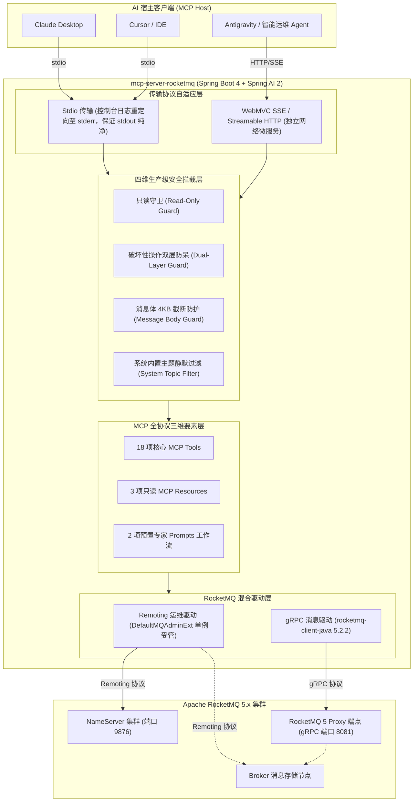

# mcp-server-rocketmq

<p align="center">
  <strong>🚀 基于 Spring AI 2 与 Spring Boot 4 构建的 Apache RocketMQ 5 智能化 Model Context Protocol (MCP) 服务端</strong>
</p>

<p align="center">
  <a href="https://github.com/atengk/mcp-server-rocketmq/actions/workflows/ci.yml">
    
  </a>
  <a href="https://github.com/atengk/mcp-server-rocketmq/releases">
    
  </a>
  <a href="https://rocketmq.apache.org/">
    
  </a>
  <a href="https://docs.spring.io/spring-ai/reference/api/mcp/mcp-overview.html">
    
  </a>
  <a href="https://spring.io/projects/spring-boot">
    
  </a>
  <a href="https://www.oracle.com/java/technologies/downloads/#java21">
    
  </a>
  <a href="./LICENSE">
    
  </a>
  <a href="./CONTRIBUTING.md">
    
  </a>
</p>

---

## 📖 项目简介

`mcp-server-rocketmq` 是专为 **Apache RocketMQ 5** 打造的企业级智能化连接服务，完全遵循开放标准 [Model Context Protocol (MCP)](https://modelcontextprotocol.io/) 规范设计，基于 **Spring AI 2 (2.0.1) + Spring Boot 4 (4.1.0) + JDK 21** 现代云原生技术栈构建。

它将大语言模型智能体（如 Claude Desktop、Cursor、Antigravity 等各类 AI 编程助手与智能运维 Agent）与分布式消息中间件 Apache RocketMQ 5 深度打通。通过暴露标准化的 MCP **Tools（工具）**、**Resources（只读资源）** 与 **Prompts（专家排障工作流）**，赋能智能体通过自然语言直接探查集群健康、秒级定位消费堆积、全链路检索消息、排查死信根因，并安全受控地执行消息收发与位点治理。

---

## 🏗️ 系统拓扑架构

本项目采用 **Remoting 深度运维管理 + gRPC 云原生消息收发** 的混合双驱动架构（详见 [ADR 0001](./docs/adr/0001-hybrid-client-architecture.md)）：



---

## ✨ 核心能力与 MCP 协议要素矩阵

本项目完整落地 Model Context Protocol 的三大核心支柱：

### 1. 🧰 MCP Tools 核心工具集 (共 18 项工具)

| 核心领域 | 工具标识 (Tool Name) | 职责说明 | 安全防护级别 |
| :--- | :--- | :--- | :--- |
| **集群拓扑域** | `rocketmq_cluster_info` | 查询 NameServer / Broker 节点分布、角色与在线状态 | 只读查询 |
| | `rocketmq_broker_stats` | 查询指定 Broker 运行时核心指标（吞吐量、写入 TPS、物理磁盘水位） | 只读查询 |
| **主题生命周期** | `rocketmq_list_topics` | 列出集群业务 Topic（自动隐藏系统内部管理主题） | 只读查询 |
| | `rocketmq_topic_route` | 查询指定 Topic 的读写队列分布与 Broker 路由详情 | 只读查询 |
| | `rocketmq_topic_status` | 查询指定 Topic 各分片队列的最小/最大 Offset 与堆积容量统计 | 只读查询 |
| | `rocketmq_create_topic` | 声明式创建或更新指定 Topic（动态配置队列数与权限） | 受 `read-only` 约束 |
| | `rocketmq_delete_topic` | 彻底清理下线指定业务 Topic | 🚨 **双层防呆保护** |
| **消费组与积压** | `rocketmq_list_consumer_groups` | 获取所有已注册的消费组清单 | 只读查询 |
| | `rocketmq_consumer_status` | 查询消费组的在线客户端 ID、IP 端口及订阅详情 | 只读查询 |
| | `rocketmq_consumer_lag` | 精确计算消费组在各分片队列的未消费堆积量 (Lag) | 只读查询 |
| | `rocketmq_top_consumer_lag` | **全集群积压排行榜**：极速检出堆积最严重的 TopN 消费组 | 只读查询 |
| | `rocketmq_reset_consumer_offset`| 按时间戳回溯或按最大位点跳过重置消费点位 | 🚨 **双层防呆保护** |
| **消息检索排查** | `rocketmq_query_message_by_id` | 根据 32 位 Message ID 精确检索消息内容与用户属性 | 只读 (4KB截断) |
| | `rocketmq_query_message_by_key`| 根据业务 Key 在指定时间窗口内扫描匹配的消息列表 | 只读 (4KB截断) |
| | `rocketmq_query_dlq_messages` | 检索指定消费组死信队列（DLQ）中的失败堆积消息 | 只读 (4KB截断) |
| | `rocketmq_query_message_trace` | 调阅单条消息自 Producer、Broker 至 Consumer 的全链路轨迹耗时 | 只读 (4KB截断) |
| **消息生产自愈** | `rocketmq_send_message` | 发送测试消息（支持普通、分区顺序与定时延时消息） | 受 `read-only` 约束 |
| | `rocketmq_resend_dlq_message` | 将死信队列中的指定消息重新投递回业务 Topic 触发重试 | 🚨 **双层防呆保护** |

### 2. 📚 MCP Resources (只读上下文资源)

客户端连接时无需主动调用工具，即可将集群基础拓扑直接作为只读上下文挂载进会话：

- **`rocketmq://cluster/topology`**：集群物理拓扑快照（包含 Broker 节点名、角色 Master/Slave、地址及健康状态）。
- **`rocketmq://topics`**：当前集群所有业务主题清单与队列分布概览。
- **`rocketmq://server/status`**：MCP Server 自身运行时配置与防护策略（只读状态、破坏性工具开启状态）。

### 3. 💡 MCP Prompts (专家预置工作流)

客户端可一键触发针对复杂故障场景的标准化编排工作流：

- **`diagnose_consumer_lag`（消费堆积深度排障流）**：
  引导 AI 自动串联：`rocketmq_top_consumer_lag`（定位慢组）$\rightarrow$ `rocketmq_consumer_status`（检查消费者客户端活跃度）$\rightarrow$ `rocketmq_query_dlq_messages`（排查死信）$\rightarrow$ 输出根因结论与扩容/位点重置治理建议。
- **`cluster_health_check`（集群健康全面巡检流）**：
  全面巡检所有 Broker 节点吞吐、物理磁盘水位、读写队列分布与业务主题容量，自动汇总为结构化 Markdown 体检周报。

---

## 🛡️ 四维生产级安全防御体系

大语言模型具有生成幻觉与理解歧义的风险。为确保企业消息队列的绝对安全，本项目构建了四维安全屏障：

1. **只读保护守卫 (Read-Only Guard)**：
   设置 `ROCKETMQ_READ_ONLY=true` 时，服务将彻底封锁所有消息发送、主题创建/删除、位点重置与死信重投工具。
2. **双层防呆机制 (Dual-Layer Guard)**：
   针对破坏性工具（删除 Topic、重置位点、死信重投），必须同时满足两层校验方可执行：
   - **层级一（启动级环境开关）**：必须显式配置 `ROCKETMQ_ENABLE_DESTRUCTIVE_TOOLS=true`；
   - **层级二（调用级显式确认）**：AI 必须在入参中显式传入 `confirm: true`，否则被短路拦截。
3. **系统主题静默屏蔽 (System Topic Filter)**：
   自动拦截并隐藏以 `%SYS%`、`TBW102`、`BenchmarkTest`、`SCHEDULE_TOPIC` 等开头的内部管理主题，避免模型破坏集群基础服务。
4. **消息体防爆截断 (Message Body Guard)**：
   消息内容优先按 UTF-8 解码，失败自动降级为 Base64。对超过 4KB 的消息体自动安全截断并附带元数据提示，彻底杜绝超长报文爆破 LLM 上下文窗口。

---

## 💬 典型交互实战（AI 是如何帮我排障的）

接入 `mcp-server-rocketmq` 后，你可以直接在聊天框用自然语言与 AI 协同完成各种复杂运维场景：

### 场景 1：秒级定位消费堆积与慢消费实例

> 👤 **用户**：“最近订单系统消费好像很慢，帮我查一下集群里有没有积压最严重的问题消费组，并分析慢消费者实例。”
> 
> 🤖 **AI 思考与动作**：
> 1. 调用 `rocketmq_top_consumer_lag` 工具，获取当前堆积量 Top 5 的消费组；
> 2. 发现 `order_payment_consumer_group` 积压了 128,400 条消息；
> 3. 自动调用 `rocketmq_consumer_status(group: "order_payment_consumer_group")` 获取该组的在线客户端列表；
> 4. 发现 4 个消费实例中有 1 个实例的处理位点停滞且 IP 不通；
> 
> 📋 **AI 诊断反馈**：
> > “经排查，当前集群积压最严重的是 **`order_payment_consumer_group`**（累计积压 **12.8 万条**）。
> > 该组共有 4 个客户端实例，其中位于 `192.168.1.152` 的节点自 20 分钟前无心跳进度，导致分配给该实例的 2 个 Queue 完全阻塞。建议优先重启该实例或触发重平衡释放分区。”

### 场景 2：根据业务订单号全链路追踪消息

> 👤 **用户**：“用户投诉订单号 `ORD_20261004_9921` 没收到发货通知，帮我查一下这笔订单的消息有没有发出来、目前到哪一步了？”
> 
> 🤖 **AI 思考与动作**：
> 1. 调用 `rocketmq_query_message_by_key(topic: "order_events_topic", key: "ORD_20261004_9921")`；
> 2. 获取到 Message ID `0A00010200002A9F000000000012C3D4`，消息体经防爆安全解析为 JSON 格式；
> 3. 自动调用 `rocketmq_query_message_trace(msgId: "0A00010200002A9F000000000012C3D4")`；
> 
> 📋 **AI 诊断反馈**：
> > “已成功定位订单消息！
> > - **Message ID**: `0A00010200002A9F000000000012C3D4`
> > - **发送时间**: `2026-10-04 20:15:32`
> > - **轨迹分析**: 消息已在 `Broker-a (Queue 2)` 正常持久化，但下游 `logistics_notice_group` 在消费过程中抛出了外部短信网关超时异常，消息已被投递到重试队列第 3 次。”

### 场景 3：死信队列排查与安全重投自愈

> 👤 **用户**：“查一下支付消费组最近产生的死信消息，分析一下失败原因；如果没问题的话帮我重新投递回业务主题重试。”
> 
> 🤖 **AI 思考与动作**：
> 1. 调用 `rocketmq_query_dlq_messages(group: "payment_process_group")`，拉取死信队列最近失败消息；
> 2. 发现死信主要由于第三方支付回调接口限流导致；
> 3. 向用户汇报原因后，调用受保护的破坏性工具：`rocketmq_resend_dlq_message(group: "payment_process_group", msgId: "0A000...", targetTopic: "payment_order_topic", confirm: true)`；
> 
> 📋 **AI 诊断反馈**：
> > “已检索到该死信消息体，报错原因为下游网关 429 Too Many Requests。目前网关已恢复，在您授权后，我已通过显式确认参数将消息重新发回业务主题 `payment_order_topic`，已被消费方成功接收处理！”

### 场景 4：一键生成集群健康巡检周报

> 👤 **用户**：“帮我对当前 RocketMQ 集群做一次全面的健康巡检，输出一份 Markdown 周报。”
> 
> 🤖 **AI 思考与动作**：
> 自动触发 MCP 预置专家工作流 `cluster_health_check`，串联 Broker 磁盘/TPS 检查与核心业务主题读写队列均衡分布分析。

---

## 🚀 快速开始与客户端配置 (Usage & Configuration)

`mcp-server-rocketmq` 采用单一自适应可执行 Jar 设计，同时原生支持 **Stdio 模式（本地宿主伴生运行）** 与 **SSE 模式（远程微服务运行）**。

### 方式一：本地 Stdio 模式 (适配 Claude Desktop、Cursor 等)

在 Stdio 模式下，宿主客户端会启动服务端进程作为子进程，并通过标准输入输出交换 JSON-RPC 报文。

#### 1.1 使用 Java Jar 运行 (推荐本地开发)

确保本机已安装 JDK 21，在各 MCP 宿主通用配置中增加：

```json
{
  "mcpServers": {
    "rocketmq": {
      "command": "java",
      "args": [
        "-jar",
        "/path/to/mcp-server-rocketmq-1.0.0-SNAPSHOT.jar",
        "--mcp.transport=stdio"
      ],
      "env": {
        "ROCKETMQ_NAMESRV_ADDR": "127.0.0.1:9876",
        "ROCKETMQ_ENDPOINTS": "127.0.0.1:8081",
        "ROCKETMQ_READ_ONLY": "false",
        "ROCKETMQ_ENABLE_DESTRUCTIVE_TOOLS": "false"
      }
    }
  }
}
```

> 💡 **标准输出纯净化保障**：
> 启动参数 `--mcp.transport=stdio` 会自动触发环境后置处理器，关闭 Web 容器、关闭 Banner，并将所有日志重定向至 `System.err`，保证 `System.out` 100% 纯净流通 JSON-RPC，杜绝解析崩溃（详见 [ADR 0003](./docs/adr/0003-single-jar-dual-mode-transport.md)）。

#### 1.2 使用 Docker 容器作为 Stdio 运行 (无需本地 Java 环境)

若本地没有 Java 21 环境，可直接通过 `docker run -i` 容器化挂载运行：

```json
{
  "mcpServers": {
    "rocketmq": {
      "command": "docker",
      "args": [
        "run",
        "-i",
        "--rm",
        "-e", "ROCKETMQ_NAMESRV_ADDR=host.docker.internal:9876",
        "-e", "ROCKETMQ_ENDPOINTS=host.docker.internal:8081",
        "-e", "ROCKETMQ_READ_ONLY=false",
        "-e", "ROCKETMQ_ENABLE_DESTRUCTIVE_TOOLS=false",
        "ghcr.io/atengk/mcp-server-rocketmq:latest",
        "--mcp.transport=stdio"
      ]
    }
  }
}
```

---

### 方式二：远程 SSE / Streamable HTTP 模式 (云端微服务部署)

将服务端部署在远程服务器或 Docker 容器内，作为网络服务常驻运行，多个 AI 宿主或协同智能体可通过 URL 直接接入。

#### 2.1 启动服务

**以可执行 Jar 启动**：
```bash
java -jar mcp-server-rocketmq-1.0.0-SNAPSHOT.jar \
  --server.port=8080 \
  --rocketmq.namesrv-addr=192.168.1.100:9876 \
  --rocketmq.endpoints=192.168.1.100:8081 \
  --rocketmq.read-only=false
```

**以 Docker 容器启动**：
```bash
docker run -d \
  --name mcp-server-rocketmq \
  -p 8080:8080 \
  -e ROCKETMQ_NAMESRV_ADDR="192.168.1.100:9876" \
  -e ROCKETMQ_ENDPOINTS="192.168.1.100:8081" \
  -e ROCKETMQ_READ_ONLY="false" \
  ghcr.io/atengk/mcp-server-rocketmq:latest
```

#### 2.2 客户端通用配置 (SSE / HTTP 接入)

在支持网络 MCP 连接的客户端中，配置 URL 端点即可：

```json
{
  "mcpServers": {
    "rocketmq": {
      "url": "http://your-server-ip:8080/mcp/sse"
    }
  }
}
```

- **SSE 监听端点**：`http://your-server-ip:8080/mcp/sse`
- **消息交互端点**：`http://your-server-ip:8080/mcp/message`

---

## ⚙️ 完整环境变量与参数清单

支持通过 **系统环境变量** 或 **命令行参数（Spring 风格）** 自由配置：

| 环境变量 | 命令行参数 | 默认值 | 详细说明 | 示例 |
| :--- | :--- | :--- | :--- | :--- |
| `ROCKETMQ_NAMESRV_ADDR` | `--rocketmq.namesrv-addr` | `127.0.0.1:9876` | RocketMQ NameServer 集群地址（多节点用分号分隔） | `192.168.1.10:9876;192.168.1.11:9876` |
| `ROCKETMQ_ENDPOINTS` | `--rocketmq.endpoints` | `127.0.0.1:8081` | RocketMQ 5.x gRPC Proxy 服务端点 | `192.168.1.10:8081` |
| `ROCKETMQ_ACCESS_KEY` | `--rocketmq.access-key` | - | ACL 访问认证密钥 AccessKey（可选） | `rocketmq2` |
| `ROCKETMQ_SECRET_KEY` | `--rocketmq.secret-key` | - | ACL 访问认证密钥 SecretKey（可选） | `12345678` |
| `ROCKETMQ_READ_ONLY` | `--rocketmq.read-only` | `false` | 全局只读守卫开关（开启后禁止所有写操作） | `true` |
| `ROCKETMQ_ENABLE_DESTRUCTIVE_TOOLS` | `--rocketmq.enable-destructive-tools` | `false` | 破坏性高危工具激活开关（删除Topic/重置位点等） | `true` |
| `MCP_TRANSPORT` | `--mcp.transport` | `sse` | 运行通信传输模式（`sse` 或 `stdio`） | `stdio` |
| `PORT` / `SERVER_PORT` | `--server.port` | `8080` | SSE 模式下的 Web 监听端口 | `8088` |

---

## ❓ 常见问题与排错指南 (FAQ)

### Q1: 在 Claude Desktop / Cursor 中使用 Stdio 模式报错 `JSON-RPC parse error`？
- **原因**：Spring Boot 启动日志、ASCII Banner 或第三方组件的调试信息混入到了标准输出 `System.out` 中。
- **解决办法**：
  1. 确保启动参数中包含 `--mcp.transport=stdio`，项目内置的环境处理器会自动关闭 Banner 并将全部 Logback 日志定向至 `System.err`；
  2. 严禁在代码中自行调用 `System.out.println`，统一使用 SLF4J 记录日志。

### Q2: 使用 Docker 运行时，报错无法连接 NameServer (`127.0.0.1:9876`)？
- **原因**：容器内的 `127.0.0.1` 指向容器自身环境，而非宿主机。
- **解决办法**：
  - 如果 RocketMQ 部署在宿主机，请将环境变量配置为 `ROCKETMQ_NAMESRV_ADDR=host.docker.internal:9876`；
  - Linux 环境可使用 `--net=host` 模式启动容器。

### Q3: 为什么调用 `rocketmq_delete_topic` 或 `rocketmq_reset_consumer_offset` 提示 403 权限被拒绝？
- **原因**：触发了系统的双层防呆安全机制（详见 [ADR 0002](./docs/adr/0002-dual-layer-safety-guard.md)）。
- **解决办法**：
  1. 服务端启动环境变量必须显式配置 `ROCKETMQ_ENABLE_DESTRUCTIVE_TOOLS=true`；
  2. 调用该工具时，入参中必须显式传递 `confirm: true` 参数。

### Q4: 我的集群是 RocketMQ 4.x（没有 gRPC Proxy），能使用本项目吗？
- **解答**：**完全可以使用绝大部分功能！**
  - 集群拓扑、Broker 指标、Topic 增删改查、消费组状态审计、实时 Lag 积压排查、位点重置以及死信检索等 **17 项运维管理与排障工具均基于 Remoting 协议**，原生完美向下兼容 4.x；
  - 仅有 `rocketmq_send_message` 测试发送工具依赖 5.x gRPC Proxy。

---

## 📂 工程目录结构

```text
.
├── .github/
│   ├── ISSUE_TEMPLATE/             # 结构化 Issue 反馈模版
│   ├── workflows/
│   │   ├── ci.yml                  # 业务构建与 PR 标题校验流水线
│   │   └── release.yml             # 基于 Git Tag 的自动化发版流水线
│   └── PULL_REQUEST_TEMPLATE.md    # PR 提交审核模版
├── docs/
│   ├── adr/                        # 架构决策记录 (ADR 0001 ~ 0005)
│   └── agents/                     # 智能体工程协作规范 (Issue/Triage/Domain)
├── .cliff.toml                     # git-cliff 变更日志自动化配置
├── .editorconfig                   # 跨编辑器编码规范
├── .gitattributes                  # 跨平台 LF 换行归一化
├── .gitignore                      # 跨语言通用忽略清单
├── AGENTS.md                       # 智能体行为与技能准则
├── CONTEXT.md                      # 领域核心术语表与统一语言
├── CONTRIBUTING.md                 # 贡献指南与 Commit 规范
├── LICENSE                         # 开源许可证 (Apache-2.0)
└── README.md                       # 项目主文档
```

---

## 🛠️ 本地构建

```bash
# 确保本地已安装 JDK 21 与 Maven 3.9+
mvn clean package -DskipTests
```

---

## 🤝 参与贡献

热烈欢迎提交 Issue、发起 Pull Request 或对功能规划提出建议！在提交代码前，请仔细查阅我们的 [贡献指南 (CONTRIBUTING.md)](./CONTRIBUTING.md)。

---

## 📄 开源许可证

本项目基于 [Apache License 2.0](./LICENSE) 协议开源。
