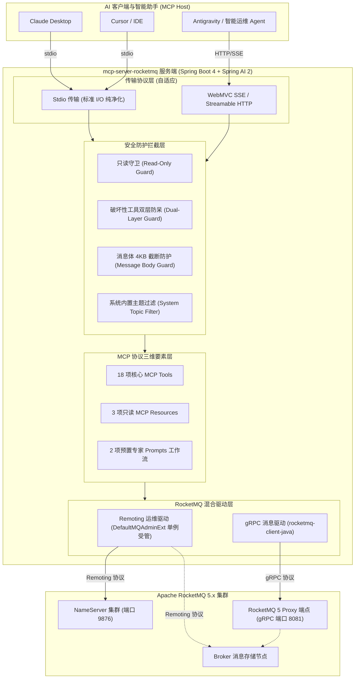

# mcp-server-rocketmq

<p align="center">
  <strong>🚀 专为 Apache RocketMQ 5 设计的 Model Context Protocol (MCP) 服务端</strong>
</p>

<p align="center">
  <a href="https://github.com/atengk/mcp-server-rocketmq/actions/workflows/ci.yml">
    
  </a>
  <a href="https://github.com/atengk/mcp-server-rocketmq/releases">
    
  </a>
  <a href="https://rocketmq.apache.org/">
    
  </a>
  <a href="https://docs.spring.io/spring-ai/reference/api/mcp/mcp-overview.html">
    
  </a>
  <a href="https://spring.io/projects/spring-boot">
    
  </a>
  <a href="https://www.oracle.com/java/technologies/downloads/#java21">
    
  </a>
  <a href="./LICENSE">
    
  </a>
  <a href="./CONTRIBUTING.md">
    
  </a>
</p>

---

## 📖 项目简介

`mcp-server-rocketmq` 是基于 [Model Context Protocol (MCP)](https://modelcontextprotocol.io/) 规范标准与 **Spring AI 2 (2.0.1) + Spring Boot 4 (4.1.0) + JDK 21** 构建的 Apache RocketMQ 智能化连接服务。

它将大语言模型（如 Claude、Cursor、GPT、DeepSeek 等 AI 编程助手与运维智能体）与分布式消息中间件 **Apache RocketMQ 5** 深度打通。通过暴露标准化的 MCP **Tools（工具）**、**Resources（只读资源）** 与 **Prompts（专家工作流）**，赋予 AI 智能体直接对 RocketMQ 集群进行全生命周期拓扑感知、深度积压排障、消息轨迹检索、死信闭环治理与安全调试收发的核心能力。

### 为什么选择 `mcp-server-rocketmq`？

- 🧠 **运维排障自然语言化**：告别繁琐的控制台翻查，直接与 AI 对话：“排查消费延迟最高的 Top 5 消费组”、“分析订单主题 `order-events` 的队列路由与健康度”；
- ⚡ **全生命周期控制面覆盖**：不仅支持只读检索，更覆盖主题创建/清理、消费进度重置、死信一键重投等闭环运维能力；
- 🛡️ **生产级双层防呆体系**：针对删除 Topic、重置位点等高危破坏性动作，内置“启动环境级开关 + 入参显式二次确认”双重守卫，杜绝大模型误操作；
- 🔌 **全形态自适应单一 Jar**：单个可执行 Jar 即可自适应本地桌面 Stdio 通信（内置控制台纯净化保障）与云端微服务 SSE / Streamable HTTP 网络通信。

---

## 🏗️ 系统架构设计

本项目采用 **Remoting 运维管理 + gRPC 消息收发混合双驱动架构**（详见 [ADR 0001](./docs/adr/0001-hybrid-client-architecture.md)）：



---

## ✨ MCP 全要素能力矩阵

本项目完整落地 Model Context Protocol 的三大支柱：

### 1. 🧰 MCP Tools 列表 (共 18 项工具)

| 功能分组 | 工具标识 (Tool Name) | 核心职责 | 安全防护约束 |
| :--- | :--- | :--- | :--- |
| **集群拓扑域** | `rocketmq_cluster_info` | 查询 NameServer / Broker 节点拓扑与在线状态 | 只读操作 |
| | `rocketmq_broker_stats` | 查询指定 Broker 的运行时核心指标（吞吐、TPS、水位） | 只读操作 |
| **主题管理域** | `rocketmq_list_topics` | 列出集群业务 Topic（自动隐藏系统内部主题） | 只读操作 |
| | `rocketmq_topic_route` | 查询指定 Topic 的读写队列分布与 Broker 路由详情 | 只读操作 |
| | `rocketmq_topic_status` | 查询指定 Topic 的最小/最大 Offset 与整体积压容量 | 只读操作 |
| | `rocketmq_create_topic` | 动态创建或更新指定 Topic（指定读写队列数与权限） | 受 `read-only` 约束 |
| | `rocketmq_delete_topic` | 彻底清理删除指定 Topic | 🚨 **受双层防呆约束** |
| **消费组与积压域** | `rocketmq_list_consumer_groups` | 获取所有已注册的消费组清单 | 只读操作 |
| | `rocketmq_consumer_status` | 查询消费组的在线客户端列表与订阅详情 | 只读操作 |
| | `rocketmq_consumer_lag` | 精确计算消费组的实时消费进度与未消费积压量 (Lag) | 只读操作 |
| | `rocketmq_top_consumer_lag` | **全集群积压排行榜**：极速检出积压最严重的 TopN 消费组 | 只读操作 |
| | `rocketmq_reset_consumer_offset`| 按时间戳或位点模式重置消费点位（回溯/跳过积压） | 🚨 **受双层防呆约束** |
| **消息检索排查域** | `rocketmq_query_message_by_id` | 根据 32 位 Message ID 精确检索消息详情与属性 | 只读 (4KB截断) |
| | `rocketmq_query_message_by_key`| 根据业务 Key 检索在指定时间窗口内的消息列表 | 只读 (4KB截断) |
| | `rocketmq_query_dlq_messages` | 检索指定消费组死信队列（DLQ）中的堆积死信详情 | 只读 (4KB截断) |
| | `rocketmq_query_message_trace` | 检索单条消息自投递至消费的全链路时间线耗时轨迹 | 只读 (4KB截断) |
| **消息生产自愈域** | `rocketmq_send_message` | 发送调试测试消息（支持普通、顺序与定时延时消息） | 受 `read-only` 约束 |
| | `rocketmq_resend_dlq_message` | 将死信队列中的指定消息重新投递至业务 Topic 重试 | 🚨 **受双层防呆约束** |

### 2. 📚 MCP Resources (只读上下文资源)

AI 宿主可在会话启动或巡检时，免调用 Tool 直接挂载只读上下文：

| 资源 URI | 资源描述 | 用途 |
| :--- | :--- | :--- |
| `rocketmq://cluster/topology` | 集群节点分布与角色在线快照 | 让 AI 直接掌握集群物理骨干拓扑 |
| `rocketmq://topics` | 集群全部业务主题清单与队列分布简报 | 让 AI 瞬间获知当前可用业务主题全景 |
| `rocketmq://server/status` | MCP 服务自身运行时配置与安全策略 | 让 AI 自知当前的权限状态（只读/破坏性工具是否开启） |

### 3. 💡 MCP Prompts (专家预置工作流)

客户端可一键触发针对复杂故障场景的标准化编排工作流：

- **`diagnose_consumer_lag`（消费堆积深度排障流）**：
  引导 AI 自动执行 `rocketmq_top_consumer_lag` 定位慢组 $\rightarrow$ 执行 `rocketmq_consumer_status` 检查消费者实例健康度 $\rightarrow$ 调阅 `rocketmq_query_dlq_messages` 判定是否有连续消费失败 $\rightarrow$ 输出根因结论与扩容/位点治理处置建议。
- **`cluster_health_check`（集群健康全面巡检流）**：
  巡检全部 Broker 节点在线率、读写队列均衡分布、吞吐水位与核心业务 Topic 健康状况，自动汇总为结构化 Markdown 体检周报。

---

## 🛡️ 安全防御体系

为防止大语言模型因幻觉或指令误解引发生产事故，本项目构建了四维安全屏障：

1. **只读保护守卫 (Read-Only Guard)**：
   配置 `ROCKETMQ_READ_ONLY=true` 时，全局禁用所有创建、删除、重置与发送工具，确保绝对只读。
2. **双层防呆机制 (Dual-Layer Guard)**：
   针对破坏性工具（删除 Topic、重置消费点位、死信重投）：
   - **层级一（启动级环境变量）**：必须显式配置 `ROCKETMQ_ENABLE_DESTRUCTIVE_TOOLS=true`；
   - **层级二（调用级显式确认）**：AI 必须在入参中显式传递 `confirm: true`，否则被短路拦截。
3. **系统主题静默屏蔽 (System Topic Filter)**：
   自动拦截并隐藏以 `%SYS%`、`TBW102`、`BenchmarkTest`、`SCHEDULE_TOPIC` 等开头的内部管理主题，避免模型破坏集群基础服务。
4. **消息体防爆截断 (Message Body Guard)**：
   消息内容优先按 UTF-8 解码，无法解析时降级 Base64。对超过 4KB 的消息体自动截断并附带元数据提示，彻底杜绝超长报文爆破 LLM 上下文窗口。

---

## ⚙️ 配置说明 (配置项与环境变量)

服务端所有配置均支持通过 **系统环境变量** 或 **命令行参数（Spring 规范）** 注入：

| 环境变量 | 命令行参数 | 默认值 | 详细说明 |
| :--- | :--- | :--- | :--- |
| `ROCKETMQ_NAMESRV_ADDR` | `--rocketmq.namesrv-addr` | `127.0.0.1:9876` | RocketMQ NameServer 地址列表（多节点分号分隔） |
| `ROCKETMQ_ENDPOINTS` | `--rocketmq.endpoints` | `127.0.0.1:8081` | RocketMQ 5.x gRPC Proxy 服务端点 |
| `ROCKETMQ_ACCESS_KEY` | `--rocketmq.access-key` | - | ACL 鉴权 AccessKey（可选） |
| `ROCKETMQ_SECRET_KEY` | `--rocketmq.secret-key` | - | ACL 鉴权 SecretKey（可选） |
| `ROCKETMQ_READ_ONLY` | `--rocketmq.read-only` | `false` | 全局只读守卫开关 |
| `ROCKETMQ_ENABLE_DESTRUCTIVE_TOOLS` | `--rocketmq.enable-destructive-tools` | `false` | 破坏性高危工具激活开关（删除/重置位点） |
| `MCP_TRANSPORT` | `--mcp.transport` | `sse` | 传输协议模式（`sse` 或 `stdio`） |
| `PORT` / `SERVER_PORT` | `--server.port` | `8080` | SSE / WebMVC 模式下的服务监听端口 |

---

## 🚀 快速接入指南

### 1. 本地 stdio 模式接入 (以 Claude Desktop / Cursor 为例)

编译打包后，在 Claude Desktop 配置文件（Windows: `%APPDATA%\Claude\claude_desktop_config.json`，macOS: `~/Library/Application Support/Claude/claude_desktop_config.json`）中添加配置：

```json
{
  "mcpServers": {
    "rocketmq": {
      "command": "java",
      "args": [
        "-jar",
        "/path/to/mcp-server-rocketmq-1.0.0-SNAPSHOT.jar",
        "--mcp.transport=stdio"
      ],
      "env": {
        "ROCKETMQ_NAMESRV_ADDR": "127.0.0.1:9876",
        "ROCKETMQ_ENDPOINTS": "127.0.0.1:8081",
        "ROCKETMQ_READ_ONLY": "false",
        "ROCKETMQ_ENABLE_DESTRUCTIVE_TOOLS": "false"
      }
    }
  }
}
```

> 💡 **标准输出纯净化**：在 `--mcp.transport=stdio` 模式下，服务自动关闭 Spring Boot Banner 与 Web 容器，并将日志全部重定向至 `System.err`，保障宿主进程解析 JSON-RPC 零异常。

### 2. 独立微服务运行 (SSE / Streamable HTTP 模式)

直接启动微服务：

```bash
java -jar mcp-server-rocketmq-1.0.0-SNAPSHOT.jar \
  --server.port=8080 \
  --rocketmq.namesrv-addr=192.168.1.100:9876 \
  --rocketmq.endpoints=192.168.1.100:8081
```

- **SSE 挂载端点**：`http://localhost:8080/mcp/sse`
- **消息交换端点**：`http://localhost:8080/mcp/message`

---

## 📂 工程目录结构

```text
.
├── .github/
│   ├── ISSUE_TEMPLATE/             # 结构化 Issue 反馈模版
│   ├── workflows/
│   │   ├── ci.yml                  # 持续集成与 PR 标题合规校验
│   │   └── release.yml             # 基于 Git Tag 的自动化发版流水线
│   └── PULL_REQUEST_TEMPLATE.md    # PR 提交审核模版
├── docs/
│   ├── adr/                        # 系统架构决策记录 (ADR 0001 ~ 0005)
│   └── agents/                     # 智能体协作配置规范 (Issue/Triage/Domain)
├── .cliff.toml                     # git-cliff 变更日志自动化配置
├── .editorconfig                   # 跨编辑器编码规范
├── .gitattributes                  # 跨平台 LF 换行归一化
├── .gitignore                      # 跨语言通用忽略清单
├── AGENTS.md                       # 智能体工程指导规范
├── CONTEXT.md                      # 领域核心术语表与统一语言
├── CONTRIBUTING.md                 # 贡献指南与 Commit 规范
├── LICENSE                         # 开源许可证 (Apache-2.0)
├── pom.xml                         # Maven 核心构建配置
└── README.md                       # 项目主文档
```

---

## 🛠️ 本地构建

```bash
# 确保本地已安装 JDK 21 与 Maven 3.9+
mvn clean package -DskipTests
```

---

## 🤝 参与贡献

欢迎提出 Issue、提交 Pull Request 或对功能提出宝贵建议！开始前请先查阅 [贡献指南 (CONTRIBUTING.md)](./CONTRIBUTING.md)。

---

## 📄 开源许可证

本项目基于 [Apache License 2.0](./LICENSE) 协议开源。
